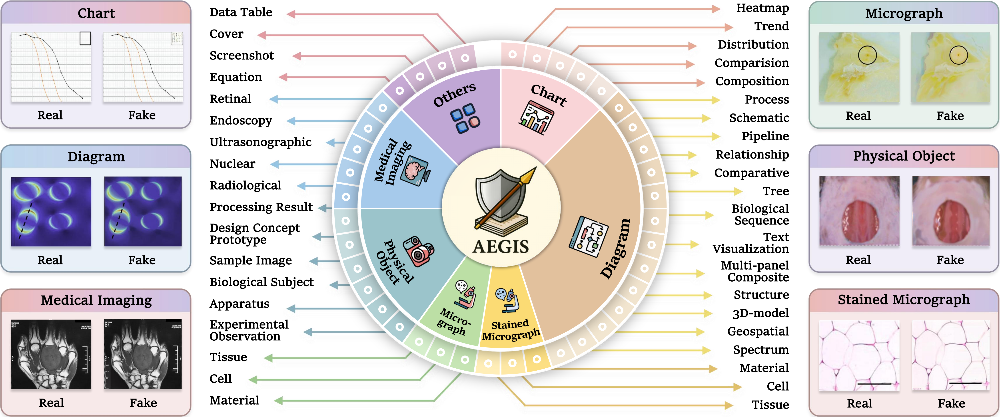

<div align="center">

<h3> AEGIS: A Holistic Benchmark for Evaluating Forensic Analysis of AI-Generated Academic Images </h3>

[Bo Zhang\*](https://github.com/HildaZhan/), 
[Tzu-Yen Ma\*](https://github.com/BUPT-Reasoning-Lab/AEGIS/) · 
[Zichen Tang](https://github.com/BUPT-Reasoning-Lab/AEGIS/) · 
[Junpeng Ding](https://github.com/BUPT-Reasoning-Lab/AEGIS/) · 
[Zirui Wang](https://github.com/BUPT-Reasoning-Lab/AEGIS/) ·  
[Yizhuo Zhao](https://github.com/BUPT-Reasoning-Lab/AEGIS/) · 
[Peilin Gao](https://github.com/BUPT-Reasoning-Lab/AEGIS/) · 
[Zijie Xi](https://github.com/BUPT-Reasoning-Lab/AEGIS/) · 
[Zixin Ding](https://github.com/BUPT-Reasoning-Lab/AEGIS/) · 
[Haiyang Sun](https://github.com/BUPT-Reasoning-Lab/AEGIS/) · 
[Haocheng Gao](https://github.com/BUPT-Reasoning-Lab/AEGIS/) ·  
[Yuan Liu](https://github.com/BUPT-Reasoning-Lab/AEGIS/) · 
[Liangjia Wang](https://github.com/BUPT-Reasoning-Lab/AEGIS/) · 
[Yiling Huang](https://github.com/BUPT-Reasoning-Lab/AEGIS/) · 
[Yujie Wang](https://github.com/BUPT-Reasoning-Lab/AEGIS/) · 
[Yuyue Zhang](https://github.com/BUPT-Reasoning-Lab/AEGIS/) ·  
[Ronghui Xi](https://github.com/BUPT-Reasoning-Lab/AEGIS/) · 
[Yuanze Li](https://github.com/BUPT-Reasoning-Lab/AEGIS/) · 
[Jiacheng Liu](https://github.com/BUPT-Reasoning-Lab/AEGIS/) · 
[Zhongjun Yang](https://github.com/BUPT-Reasoning-Lab/AEGIS/) · 
[Haihong E†](https://github.com/BUPT-Reasoning-Lab/AEGIS/)

\* Equal contribution  † Corresponding author

Beijing University of Posts and Telecommunications

  <p align="center">
    <!-- <a href='https://arxiv.org/pdf/2412.04292'>
       </a> -->
    <a href='https://bupt-reasoning-lab.github.io/AEGIS/' style='padding-left: 0.5rem;'>
       </a>
    <a href='https://huggingface.co/datasets/BUPT-Reasoning-Lab/AEGIS/' style='padding-left: 0.5rem;'>
       
  </p>
</div>


## 📰 News
- **[2026.4.6]**: 🎉 AEGIS was accepted to ACL 2026 Main Conference! 
- **[2025.4.29]**: 🤗 AEGIS dataset are released on huggingface. Check out [here](https://huggingface.co/datasets/BUPT-Reasoning-Lab/AEGIS/tree/main).
<!-- - **[2025.3.20]**: 🔥 We have released **Spot the Fake: Large Multimodal Model-Based Synthetic Image Detection with Artifact Explanation**. Check out the [paper](https://arxiv.org/abs/2503.14905). We present FakeClue dataset and FakeVLM model. -->

## 🔍 Overview

<div align="center">

</div>

We introduce AEGIS, A holistic benchmark for Evaluating forensic analysis of AI-Generated academic ImageS. Compared to existing benchmarks, AEGIS features three key advances: (1) Domain-Specific Complexity: covering seven academic categories with 39 fine-grained subtypes, exposing intrinsic forensic difficulty, where even GPT-5.1 reaches 48.80% overall performance and expert models achieve only limited localization accuracy (IoU 30.09%); (2) Diverse Forgery Simulations: modeling four prevalent academic forgery strategies across 25 generative models, with 11 yielding average forensic accuracy below 50%, showing that forensics lag behind generative advances; and (3) Multi-Dimensional Forensic Evaluation: jointly assessing detection, reasoning, and localization, revealing complementary strengths between model families, with multimodal large language models (MLLMs) at 84.74% accuracy in textual artifact recognition and expert detectors peaking at 79.54% accuracy in binary authenticity detection. By evaluating 25 leading MLLMs, nine expert models, and one unified multimodal understanding and generation model, AEGIS serves as a diagnostic testbed exposing fundamental limitations in academic image forensics.


## 🛠️ Installation

use `uv` dependency groups to install benchmark runtime dependencies.

### 1) Create environment

```bash
python -m venv .venv
. .venv/bin/activate
python -m pip install -U pip
python -m pip install uv
```

### 2) Install benchmark dependencies

```bash
UV_CACHE_DIR="$(pwd)/.uv-cache" uv sync --group benchmark
```

### 3) (Optional) Install few-shot retrieval dependencies

The few-shot suite requires a retrieval engine (`query-engine`), which can be heavy.
Install it only if you plan to run `--suite few_shot`:

```bash
UV_CACHE_DIR="$(pwd)/.uv-cache" uv sync --group few-shot
```

### 4) Run a sanity check (no API calls)

```bash
PYTHONPATH=./scripts python -m benchmark.main --suite basic --dry-run --max-items 2
```

### 5) Run benchmark (will call model APIs)

```bash
PYTHONPATH=./scripts python -m benchmark.main --suite basic
```

You can also run:

```bash
PYTHONPATH=./scripts python -m benchmark.main --suite cot
PYTHONPATH=./scripts python -m benchmark.main --suite few_shot
```


## 🤗 Dataset

AEGIS data is hosted on Hugging Face:
[`BUPT-Reasoning-Lab/AEGIS`](https://huggingface.co/datasets/BUPT-Reasoning-Lab/AEGIS/).

After downloading, the `assets/` directory should be placed at the repository root.
The directory containing the images should have the following structure:

```text
assets/
├── dataset/
│   ├── image_inference_forgery.json
│   ├── real.json
│   ├── targeted_region_restoration.json
│   ├── targeted_region_editing.json
│   └── text_constraint_fabrication.json
├── reference_answer/
│   ├── forgery_scope_discrimination.json
│   ├── textual_artifact_recognition.json
│   ├── manipulation_classification.json
│   └── tampering_pinpointing.json
└── dataset/
    ├── image_inference_forgery/
    ├── real/
    ├── targeted_region_restoration/
    │   ├── fake/
    │   └── mask/
    │   └── highlight/
    ├── targeted_region_editing/
    │   ├── fake/
    │   └── mask/
    │   └── highlight/
    └── text_constraint_fabrication/
```

Notes:

- The benchmark runner reads dataset JSONs from `assets/dataset/*.json`.
- Each dataset JSON item should contain an `image_path` field pointing to a file under `assets/`.
- For manipulation classification tasks, the runner expects **highlighted** images (red-marked regions). The default logic uses `fake -> highlight` path replacement.

### Few-shot retrieval assets (optional)

If you plan to run `--suite few_shot`, you also need the retrieval index and embedder:

```text
assets/
├── dataset_with_vector_index.db
└── facebook/
    └── dinov3-vits16-pretrain-lvd1689m/
```


## 📨 Contact

Haihong E: [ehaihong@bupt.edu.cn]